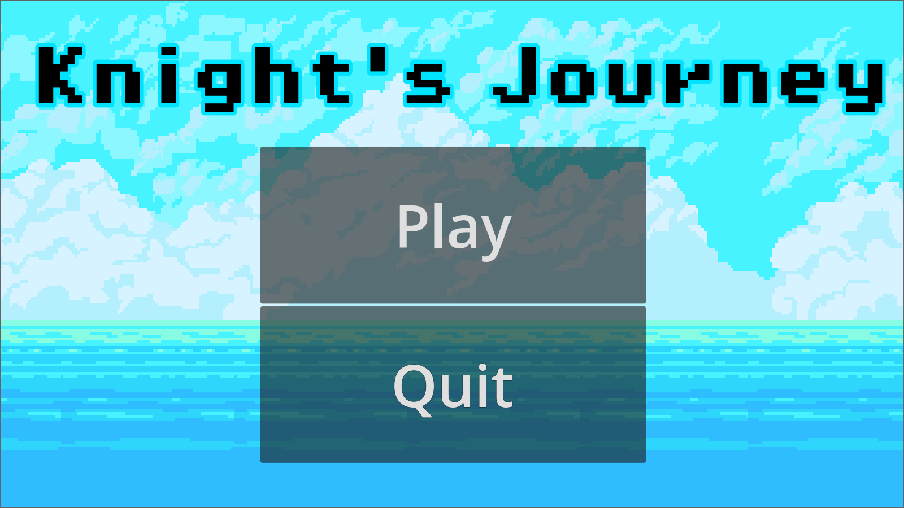
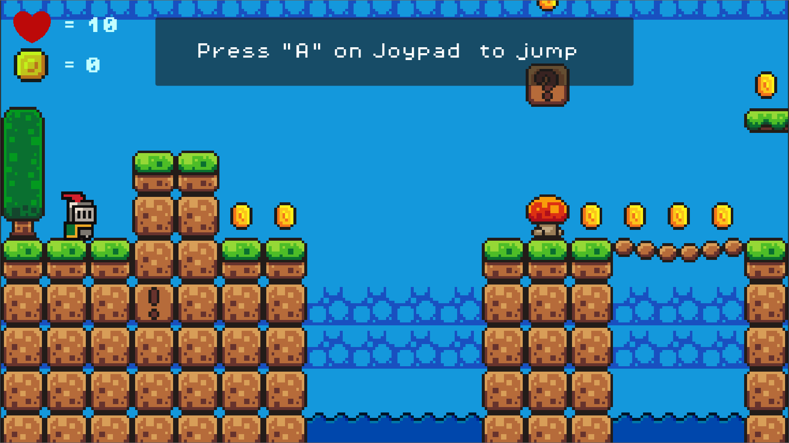
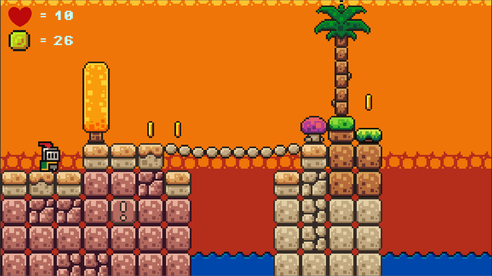
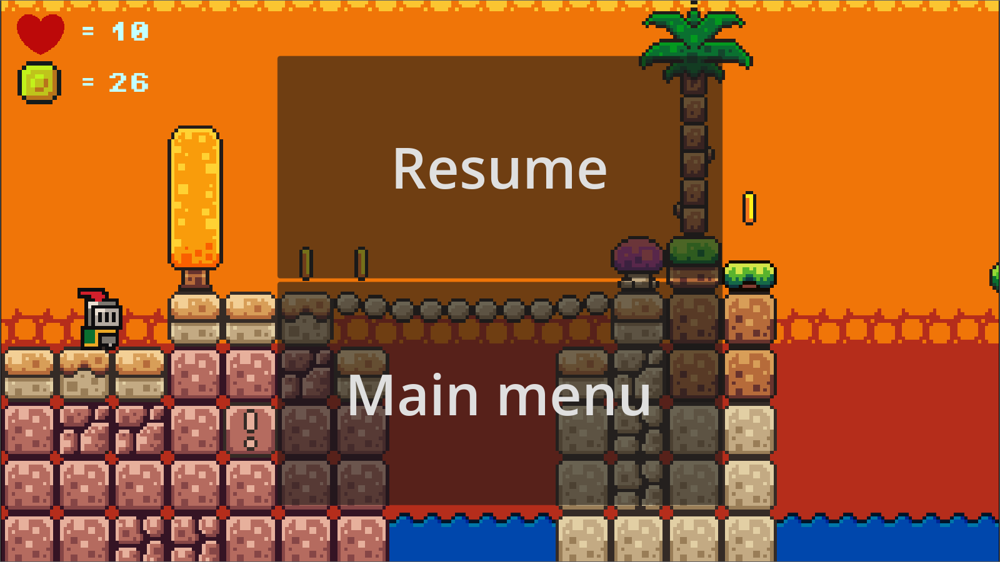

# Team

- Mohamad Abdul Aziz (A18.2023.00043)
-	Zakaria (A18.2023.00048)
-	Izal Aoni (A18.2023.00049)
-	Ratono (A18.2023.00050)

=== PJJ Teknik Informatika Udinus ===

# About
Project UAS Mata kuliah Game Programming membuat game design document dan implementasi sebuah prototipe video game sederhana 
menggunakan Godot Engine

Nama Game : Aldric Knight's Journey

# Game Design Documents (GDD)
[GAME DESIGN DOCUMENT (GDD)](https://github.com/abdulazizmohamad/Knightsjourney/blob/main/GAME%20DESIGN%20DOCUMENT%20(GDD).pdf)

# Guide

Keyboard :
- Right Arrow (→) : untuk menggerakkan karakter ke arah kanan
- Left Arrow (←) : untuk menggerakkan karakter ke arah kiri
- Space : untuk Lompat / Jump
- J : Menembak / Shoot
- L : Lift

Gamepad :
- D-Pad (Left & Right) : menggerakkan karakter ke arah kanan dan kiri
- A : Lompat / Jump
- B : Menembak / Shoot
- Y : Lift
- X : Roll

*Note : Use Gamepad for better experience

# Presentation & Gameplay
[YouTube](https://youtu.be/sUcSk56xLVs)

